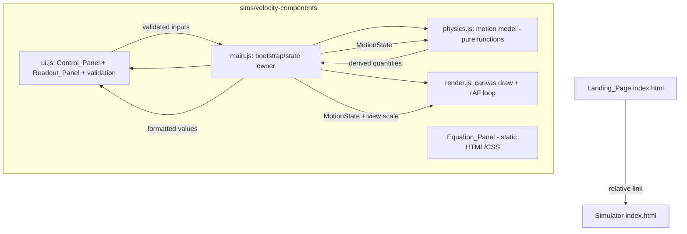
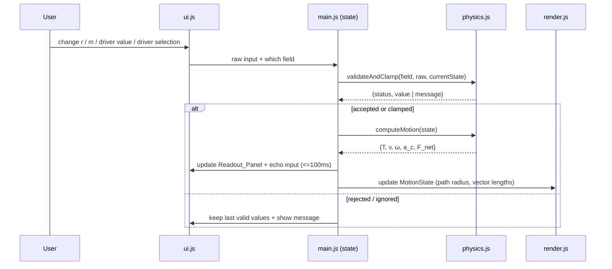
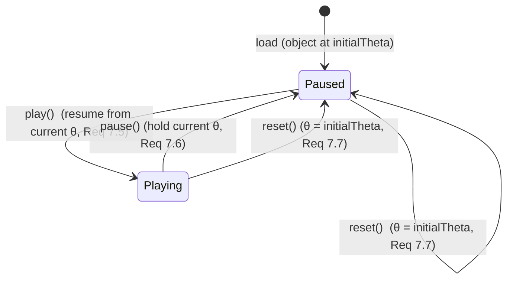

# Design Document

## Overview

The Velocity Components Simulator is a static, zero-build web application that
teaches **uniform circular motion**. A learner manipulates three independent
inputs — radius `r`, mass `m`, and a single temporal *motion driver* (one of
period `T`, tangential speed `v`, or angular speed `ω`) — and watches an object
travel around a circle while the coupled quantities (`T`, `v`, `ω`) and derived
quantities (centripetal acceleration `a_c`, net centripetal force `F_net`) update
live. The simulator draws the **tangential velocity vector** (always tangent to
the path, in the direction of motion) and the **centripetal force/acceleration
vector** (always pointing to the center), and shows live numeric readouts and the
governing equations.

### Design Goals

1. **Runs from `file://` with zero setup.** No server, no build step, no package
   install, no external/CDN dependency. Opening `index.html` from disk must work
   (Requirements 1, 2).
2. **Physically correct and internally consistent.** All coupled and derived
   quantities agree with the governing equations within a 0.1% relative tolerance
   (Requirements 4, 5).
3. **Faithful visualization.** The object completes one revolution in real time
   `T` (±5%), the velocity vector stays tangent (±1°), and the force vector stays
   center-pointing (±1°) (Requirements 7, 8, 9).
4. **Extensible.** The repository layout supports adding more physics simulations
   later under `sims/` without restructuring — hence the plural delivery branch
   `physics-simulators`.

### Key Technical Decisions

| Decision | Rationale |
|---|---|
| **Vanilla HTML/CSS/JavaScript** — no framework, no bundler. | Frameworks require a build step or CDN; both violate the `file://` / zero-build constraint (Req 1.2, 2.4). |
| **Classic `<script>` tags / inline scripts — NOT ES modules.** | ES module imports (`<script type="module">`) are subject to CORS restrictions under the `file://` origin in Chrome and other browsers, so cross-file `import` statements fail when opened from disk. Classic scripts loaded via relative `src` are not CORS-gated and load reliably from `file://` (Req 2.4, 2.6). Code is namespaced under a single global object to avoid polluting the global scope. |
| **HTML `<canvas>` for the Animation_View.** | Efficient per-frame redraw of the path, moving object, and two vectors; easily sustains ≥30 FPS (Req 7.8). SVG/DOM animation would be heavier for continuous motion. |
| **`requestAnimationFrame` (rAF) render loop with time-delta integration.** | rAF is frame-synced and pauses in background tabs; integrating angular position from elapsed wall-clock time (not per-frame constants) keeps the revolution time locked to real `T` regardless of frame rate (Req 7.3). |
| **Single canonical motion state `{T, v, ω}` kept mutually consistent.** | Storing all three consistent values (rather than only the driver) makes driver-switch preservation trivial and guarantees the coupling invariants hold at all times (Req 4.5–4.7). |
| **Local relative asset paths only.** | Guarantees resolution over `file://` and keeps the simulator self-contained (Req 2.2, 2.6). |

### Browser Compatibility Notes

- Assets are referenced with repository-relative paths (e.g., `sims/velocity-components/index.html`, `./sim.js`) so they resolve identically under `file://` and `http(s)://`.
- No `fetch`, `XMLHttpRequest`, `WebSocket`, or remote font/script/style is used, satisfying the "no network request" constraint (Req 2.3). Any fonts are system/generic fallbacks; any equation notation uses Unicode + CSS (see Equation_Panel), not an external math library.
- Because classic scripts are used, load-failure detection relies on `window.onerror` and per-`<script>`/`<link>` `onerror` handlers plus a runtime self-check, rather than module import errors (Req 2.7, 1.6).

## Architecture

### Repository / File Layout

The layout is intentionally shallow and extensible: the root hosts a landing page
that links into a `sims/` directory, and each individual simulation lives in its
own subfolder so additional simulations can be dropped in later without touching
existing ones.

```
physics/                              (repo root)
├── index.html                        Landing_Page (Req 1.1)
├── README.md
└── sims/                             Sims_Folder (Req 2.1)
    └── velocity-components/          This simulation (self-contained)
        ├── index.html                Simulator page (markup + Equation_Panel)
        ├── sim.css                   Styles (layout, colors, panels)
        ├── physics.js                Pure computation model (no DOM)
        ├── render.js                 Canvas drawing + animation loop
        ├── ui.js                     Control wiring, validation, readouts
        └── main.js                   Bootstrap: wires physics + render + ui
```

Notes:
- All simulator assets live inside `sims/velocity-components/`; nothing simulator-specific is stored outside `sims/` (Req 2.2).
- Scripts are included at the bottom of the simulator `index.html` via
  `<script src="physics.js"></script>`, `<script src="render.js"></script>`,
  `<script src="ui.js"></script>`, `<script src="main.js"></script>` (in
  dependency order). Each attaches to a single global namespace `VCS`
  (Velocity Components Simulator) rather than using ES `import`/`export`.
- Adding a future simulation means creating `sims/<new-sim>/` and adding a link
  card on the Landing_Page — no change to this simulation.

### Runtime Component Diagram



### Module Responsibilities

- **`physics.js` (pure, DOM-free):** Given `{r, m, driver, driverValue}` it computes
  the consistent triple `{T, v, ω}` and derived `{a_c, F_net}`. Also owns clamping,
  validation classification, driver-switch preservation, and number formatting
  helpers. Being pure and side-effect-free, it is the primary target for
  property-based testing.
- **`render.js`:** Owns the canvas, the coordinate mapping (meters → pixels), the
  `requestAnimationFrame` loop, the play/pause/reset state machine, angular
  position integration, and drawing of path, object, velocity vector, and force
  vector (including scaling, clamping, arrowheads, labels, colors).
- **`ui.js`:** Builds/handles the Control_Panel widgets, the driver selector, the
  force-display toggle, input validation feedback (messages), and writes the
  Readout_Panel and driver-input echo values.
- **`main.js`:** Holds the authoritative application state, orchestrates the flow
  (input change → validate → recompute via physics → update readouts + render),
  and performs the asset self-check for error messaging.

### Data-Flow Sequence (input change)



## Components and Interfaces

### `VCS.physics` (physics.js)

Pure functions; no DOM, no global mutation. Signatures expressed as JSDoc-style
contracts (implementation is plain JS).

```
// Ranges (inclusive) — single source of truth for bounds.
VCS.physics.RANGES = {
  r:     { min: 0.1, max: 10,  unit: "m"      },   // Req 3.5
  m:     { min: 0.1, max: 100, unit: "kg"     },   // Req 3.6
  T:     { min: 0.5, max: 60,  unit: "s"      },   // Req 3.7
  v:     { min: 0.1, max: 100, unit: "m/s"    },   // Req 3.9
  omega: { min: 0.1, max: 12,  unit: "rad/s"  }    // Req 3.10
};
VCS.physics.TAU = 2 * Math.PI;

// computeTriple(r, driver, driverValue) -> { T, v, omega }
//   driver ∈ {"T","v","omega"}. Computes the two non-driver temporal
//   quantities from the governing equations, keeping driverValue exact.
//     driver "T":     v = 2πr/T ;   ω = 2π/T
//     driver "v":     T = 2πr/v ;   ω = v/r
//     driver "omega": v = rω    ;   T = 2π/ω
//   (Req 4.1–4.5)

// computeDerived(r, m, triple) -> { a_c, F_net }
//   a_c computed as v²/r; F_net = m·a_c. rω² is used as a cross-check only.
//   Both are non-negative magnitudes. (Req 5.1–5.6)

// computeMotion(state) -> { T, v, omega, a_c, F_net }
//   Convenience: computeTriple then computeDerived. (Req 4, 5)

// classifyInput(field, raw) -> { status, value?, message? }
//   status ∈ {"accepted","clamped","rejected","ignored"}.
//     non-numeric/empty              -> "ignored"  (Req 11.6)
//     numeric <= 0                   -> "rejected" (Req 11.1–11.4)
//     numeric > 0 but out of range   -> "clamped"  (value = nearest bound) (Req 11.5)
//     numeric within range           -> "accepted"
//   field ∈ {"r","m","T","v","omega"}.

// switchDriver(state, newDriver) -> newState
//   Preserves the current {T, v, ω} triple; sets driverValue to the current
//   value of newDriver so no quantity changes on switch. (Req 4.6–4.7)

// formatValue(x) -> string
//   <=3 decimal places; if 0 < |x| < 0.001, use exponential/precision form
//   preserving >=1 significant figure instead of "0.000". (Req 6.3–6.4)
```

### `VCS.render` (render.js)

```
// init(canvas, getState, getViewOptions) -> controller
//   controller = { play(), pause(), reset(), isPlaying(), currentAngle() }
//   Implements the play/pause/reset state machine (Req 7.4–7.7).

// Internal per-frame step(now):
//   dt = (now - lastTs)/1000
//   if playing: θ += direction * (2π / T) * dt      // one rev per real T (Req 7.3)
//   draw(path, object at θ, velocity vector, force vector)
//   requestAnimationFrame(step)

// Coordinate mapping (meters -> pixels):
//   R_px = mapRadius(r)  — monotonic increasing in r, with margin reserved for
//   vectors + labels so the whole path stays inside the canvas (Req 7.1).
//   center = (canvas.width/2, canvas.height/2).
//   object = center + R_px*(cosθ, sinθ)  (canvas y grows downward).

// Vector geometry:
//   radial unit (obj->center):  u_c = (center - obj)/|center - obj|
//   tangent unit (dir of motion): u_v = direction * (-sinθ, cosθ)  [⊥ to radius]
//   Velocity_Vector: tail=obj, dir=u_v, length = L_v(v)  (Req 8)
//   Force_Vector:    tail=obj, dir=u_c, length = L_f(F_net) [if enabled] (Req 9)
```

### `VCS.ui` (ui.js)

```
// buildControls(root, handlers) — creates sliders + numeric inputs for r, m,
//   the active driver, a driver <select> (T/v/ω), a force-display toggle,
//   play/pause/reset buttons. (Req 3, 7.4, 9.7)
// updateReadouts(values) — writes r,m,T,v,ω,a_c,F_net with units + formatting
//   (Req 6). echoDriverInput(driver, value) after a switch (Req 4.7).
// showMessage(field, text) / clearMessage(field) — validation feedback
//   (Req 11.2–11.7).
// showAssetError(text) — global visible banner for load failures (Req 1.6, 2.7).
```

### Landing Page (`index.html`) interface

- Contains a visible, labeled control (link/button) within the initial viewport
  that launches the simulator via the relative path
  `sims/velocity-components/index.html` (Req 1.3, 1.5).
- On activation, if navigation/load fails, shows an inline message and stays on
  the page (Req 1.6). Implemented by attempting navigation and detecting failure
  (e.g., verifying the target via a guarded navigation with an error fallback),
  without any network call.
- Structured as a card list so future simulations can be added as additional
  cards (extensibility).

## Data Models

### MotionState (authoritative app state in `main.js`)

```
MotionState = {
  r:          number,   // meters, within RANGES.r          (last valid)
  m:          number,   // kilograms, within RANGES.m        (last valid)
  driver:     "T" | "v" | "omega",   // selected Motion_Driver (default "T", Req 3.11)
  driverValue:number,   // exact user-entered value of the active driver (Req 4.5)

  // Derived/cached consistent quantities (recomputed on every accepted change):
  T:          number,   // seconds
  v:          number,   // meters/second
  omega:      number,   // radians/second
  a_c:        number,   // meters/second²  (>= 0)
  F_net:      number    // newtons         (>= 0)
}
```

Invariant maintained after every accepted update: the tuple `{T, v, ω}` satisfies
`v = 2πr/T`, `ω = 2π/T`, `v = rω` within 0.1%, and `a_c`, `F_net` satisfy the
force/acceleration equations within 0.1% (Req 4, 5).

### ViewState (owned by `render.js`)

```
ViewState = {
  theta:        number,   // current angular position (radians)
  initialTheta: number,   // fixed reference start position (for reset, Req 7.7)
  direction:    +1 | -1,  // sense of travel (constant)
  playing:      boolean,  // state-machine flag (Req 7.5–7.7)
  showForce:    boolean,  // force-display toggle (Req 9.5–9.7)
  R_px:         number,   // current displayed path radius in pixels (Req 7.1)
  lastTs:       number    // last rAF timestamp for dt integration
}
```

### Default Initial Inputs (on load)

```
r = 2 m, m = 1 kg, driver = "T", T = 4 s
=> v = 2π·2/4 ≈ 3.142 m/s, ω = 2π/4 ≈ 1.571 rad/s,
   a_c = v²/r ≈ 4.935 m/s², F_net = m·a_c ≈ 4.935 N
```
These are all within range and produce a calm ~4 s revolution for an inviting
initial view. Readouts are populated from these before any interaction (Req 6.5).

### Rendering Scale Functions

- **Path radius:** `R_px = R_min_px + (R_max_px - R_min_px) · (r - r_min)/(r_max - r_min)`,
  a monotonic linear map from `r ∈ [0.1, 10]` to `[R_min_px, R_max_px]`, where
  `R_max_px` leaves a margin (for vector length + label text) inside the canvas so
  the full circle always fits (Req 7.1).
- **Velocity vector length:** `L_v = k_v · v`, `k_v > 0` constant, optionally
  clamped to a visual max so it stays readable; monotonic increasing in `v`
  (Req 8.6).
- **Force vector length:** `L_f = clamp(k_f · F_net, 0.05·R_px, 1.00·R_px)` with a
  single constant `k_f`; the pre-clamp ratio `L_f/F_net = k_f` is constant, and the
  displayed length is bounded to [5%, 100%] of `R_px` (Req 9.5–9.6).

### State Machine (animation)




## Correctness Properties

*A property is a characteristic or behavior that should hold true across all valid
executions of a system — essentially, a formal statement about what the system
should do. Properties serve as the bridge between human-readable specifications and
machine-verifiable correctness guarantees.*

This feature is well-suited to property-based testing because the physics/computation
layer (`physics.js`) and the vector/scale geometry helpers (`render.js`) are pure
functions with universal invariants over large numeric input spaces. The
landing-page structure, canvas frame-rate, DOM presence, colors/labels, and
`file://` behavior are validated by example, integration, and smoke tests instead
(see Testing Strategy).

The following properties were derived from the prework analysis. Redundant
criteria were consolidated (e.g., per-frame orientation criteria are the same
invariant as their base orientation properties evaluated over all positions).

### Property 1: Temporal coupling consistency

*For all* valid `r` and any selected driver value producing an in-range motion
state, the computed triple `{T, v, ω}` satisfies `v = 2πr/T`, `ω = 2π/T`, and
`v = rω`, each within a relative tolerance of 0.1%.

**Validates: Requirements 4.1, 4.2, 4.3, 4.4**

### Property 2: Driver value retained exactly

*For all* driver selections and valid entered driver values, the corresponding
quantity in the computed triple equals the entered value exactly (no rounding or
drift).

**Validates: Requirements 4.5**

### Property 3: Driver-switch preservation and echo

*For all* valid motion states, switching the Motion_Driver to any other quantity
without entering new values preserves `T`, `v`, and `ω` within 0.1%, and the input
control for the newly selected driver is populated with the preserved value of that
quantity.

**Validates: Requirements 4.6, 4.7**

### Property 4: Centripetal acceleration consistency

*For all* valid motion states, the computed centripetal acceleration `a_c` satisfies
both `a_c = v²/r` and `a_c = rω²` within 0.1%; consequently the two formulas agree
with each other within 0.1%.

**Validates: Requirements 5.1, 5.2, 5.5**

### Property 5: Centripetal force consistency

*For all* valid motion states, the computed net centripetal force `F_net` satisfies
both `F_net = m·a_c` and `F_net = m·v²/r` within 0.1%.

**Validates: Requirements 5.3, 5.4**

### Property 6: Non-negative acceleration and force

*For all* valid motion states, the computed `a_c` and `F_net` are non-negative
magnitudes (`>= 0`).

**Validates: Requirements 5.6**

### Property 7: Range clamping of numeric inputs

*For all* numeric input values strictly greater than zero and for any Control_Panel
field, the value accepted or produced by validation lies within that field's
inclusive range, and any strictly-positive value outside the range is mapped to the
nearest bound.

**Validates: Requirements 3.5, 3.6, 3.7, 3.9, 3.10, 11.5**

### Property 8: Invalid input leaves last valid state unchanged

*For all* inputs the simulator rejects or ignores — a non-positive radius, mass, or
period, or a non-numeric/empty entry for any field — the last valid MotionState (and
therefore the seven displayed readout values) remains unchanged.

**Validates: Requirements 6.7, 11.1, 11.3, 11.4, 11.6**

### Property 9: Validation message clearing round-trip

*For all* fields displaying a rejection/ignored-input message, entering any
subsequently accepted or clamped value for that field removes the associated
message.

**Validates: Requirements 11.7**

### Property 10: Numeric formatting rules

*For all* real numbers, `formatValue` produces a string with at most 3 decimal
places; and for all nonzero values whose magnitude is less than 0.001, the output
preserves at least one significant figure rather than rendering as `0.000`.

**Validates: Requirements 6.3, 6.4**

### Property 11: Path radius monotonic scaling and containment

*For all* pairs of radius values `r1 < r2` in range, the displayed path radius
satisfies `R_px(r1) < R_px(r2)`, and for all radii in range the displayed circular
path (including its reserved margin) fits within the visible bounds of the
Animation_View.

**Validates: Requirements 7.1**

### Property 12: Object and vectors anchored on the path

*For all* angular positions `θ`, the rendered object lies on the circular path (its
distance from the center equals `R_px` within a small epsilon), and both the
Velocity_Vector tail and the Force_Vector tail coincide with the object's position.

**Validates: Requirements 7.2, 8.1, 9.1**

### Property 13: Revolution timing matches real period

*For all* valid periods `T` and any sequence of frame time-deltas whose sum equals
`T`, integrating the angular position advances the object by exactly one revolution
(`2π`) within a relative tolerance of 5%.

**Validates: Requirements 7.3**

### Property 14: Reset invariance

*For all* angular positions `θ` and for both playing and paused states, activating
reset returns the object to the fixed initial position (`θ = initialTheta`) and
leaves the animation in the paused state.

**Validates: Requirements 7.7**

### Property 15: Velocity vector orientation

*For all* angular positions `θ`, the Velocity_Vector is perpendicular to the radius
line from center to object (90° within 1°) and points in the object's instantaneous
direction of travel (0° within 1°), including on every frame while playing.

**Validates: Requirements 8.2, 8.3, 8.4**

### Property 16: Velocity vector length monotonic in speed

*For all* pairs of tangential speeds `v1 < v2`, the rendered Velocity_Vector length
satisfies `L_v(v1) < L_v(v2)`.

**Validates: Requirements 8.6**

### Property 17: Force vector orientation toward center

*For all* angular positions `θ`, the Force_Vector points from the object toward the
center of the circle (0° between the vector and the object-to-center radius line,
within 1°), including on every frame while playing.

**Validates: Requirements 9.2, 9.3**

### Property 18: Force vector length linearity (pre-clamp)

*For all* net force magnitudes `F_net` whose scaled length falls within the allowed
display range, the ratio of unclamped displayed length to `F_net` equals the single
constant scale factor `k_f` within a relative tolerance of 1%.

**Validates: Requirements 9.5**

### Property 19: Force vector length clamping bounds and idempotence

*For all* net force magnitudes and displayed path radii, the displayed Force_Vector
length lies within `[0.05·R_px, 1.00·R_px]`, and applying the clamp to an
already-clamped length yields the same value (clamping is idempotent).

**Validates: Requirements 9.6**

## Error Handling

Error handling covers two distinct classes: **asset/load failures** (structural,
affecting whether the app runs at all) and **input validation** (runtime, per
Control_Panel entry).

### Asset and Load Failures

| Scenario | Detection | Response |
|---|---|---|
| Simulator page cannot be opened from Landing_Page (Req 1.6) | Guarded navigation with an error fallback; no network call. | Show an inline message on the Landing_Page ("The simulator could not be opened") and remain on the Landing_Page. |
| A simulator asset (CSS/JS) fails to load (Req 2.7) | `onerror` handlers on `<link>`/`<script>` tags plus a `main.js` runtime self-check that each expected namespace object (`VCS.physics`, `VCS.render`, `VCS.ui`) exists. | Render a visible in-page banner ("A required asset could not be loaded"). |
| Canvas/2D context unavailable | Feature check of `canvas.getContext("2d")`. | Show the asset-error banner with a fallback message; readouts and equations still render. |

Because the app uses classic scripts (not ES modules) loaded by relative path,
these detection mechanisms work under `file://` without triggering CORS or
requiring network access (Req 2.3, 2.6).

### Input Validation (Control_Panel)

Validation is centralized in `VCS.physics.classifyInput(field, raw)` and applied by
`main.js` before any recompute. Classification and response:

| Condition | Status | Action | Message | Requirements |
|---|---|---|---|---|
| Non-numeric or empty | `ignored` | Retain last valid value; re-display it (<100 ms) | "Input ignored; kept last valid value" | 11.6 |
| Numeric `<= 0` for r, m, or T | `rejected` | Retain last valid value; re-display it (<100 ms) | "Value must be greater than zero; rejected" | 11.1, 11.2, 11.3, 11.4 |
| Numeric `> 0` but outside range | `clamped` | Replace with nearest bound; display clamped value (<100 ms) | (optional advisory; value corrected) | 11.5, 3.5–3.10 |
| Numeric within range | `accepted` | Use value; recompute | Clear any prior message for the field | 11.7 |

Additional rules:
- On any rejected/ignored/invalid entry, the Readout_Panel continues to show the
  values from the last valid inputs (Req 6.7) — a direct consequence of not
  mutating MotionState until an accepted/clamped value is produced.
- Entering a valid (accepted or clamped) value after a bad one removes that field's
  message within 100 ms (Req 11.7).
- Messages are per-field and rendered as visible text adjacent to the relevant
  control (Req 11.2, 11.3, 11.4, 11.6).
- Derived quantities (`a_c`, `F_net`) are always `>= 0` by construction from
  non-negative inputs and squared speeds (Req 5.6), so no negative-magnitude error
  state is reachable.

## Testing Strategy

A dual approach is used: **property-based tests** verify universal invariants of the
pure computation and geometry layers across large input spaces, while
**example/integration/smoke tests** verify concrete UI behavior, rendering
appearance, and the `file://`/zero-build environment.

### Property-Based Tests

- **Library:** A zero-dependency, vendored property-testing helper is used so the
  test tooling itself does not violate the no-external-dependency posture of the
  deliverable. Tests run in a plain HTML test runner (`sims/velocity-components/`
  is production; tests live separately and are not shipped as simulator assets, so
  Req 2.2 is preserved). If a Node/JS test runner is used during development,
  `fast-check` is the recommended property library; it is a dev-time dependency
  only and is never referenced by the shipped simulator.
- **Do NOT implement property-based testing from scratch** beyond the thin vendored
  generator/shrinker helper; use the chosen library's generators and shrinking.
- **Iterations:** Each property test runs a **minimum of 100 iterations**.
- **Tagging:** Each property test is tagged with a comment in the format
  **`Feature: velocity-components-simulator, Property {number}: {property_text}`**
  referencing the corresponding property above.
- **One test per property:** Each of Properties 1–19 is implemented by a single
  property-based test.
- **Generators:**
  - Valid states: `r ∈ [0.1, 10]`, `m ∈ [0.1, 100]`, driver ∈ {T, v, ω} with the
    driver value in its range; angular position `θ ∈ [0, 2π)`.
  - Invalid inputs: values `<= 0`, out-of-range positive values, and
    non-numeric/empty strings (edge generators feed Properties 7, 8, 9).
  - Small magnitudes `0 < |x| < 0.001` and large/edge reals for the formatting
    property (Property 10).
  - Frame-delta schedules summing to `T` for the timing integrator (Property 13).
- **Tolerances:** relative 0.1% for coupling/derived properties (1–5), 1° for
  vector-angle properties (15, 17), 1% for force-linearity (18), 5% for revolution
  timing (13).

### Example-Based Unit Tests

- Default initial state on load: readouts equal `computeMotion(defaults)` before
  interaction (Req 6.5); default driver is `T` (Req 3.11).
- Control_Panel presence: inputs for r, m, active driver, driver selector,
  force-display toggle, and play/pause/reset controls exist with correct
  units/labels (Req 3.1–3.4, 7.4, 9.7).
- Readout_Panel presence and units for all seven quantities (Req 6.1, 6.2).
- Validation messages appear for a non-positive r/m/T and for non-numeric input
  (Req 11.2, 11.3, 11.4, 11.6).
- State-machine transitions: pause holds position (Req 7.6); play resumes from held
  position (Req 7.5).
- Vector distinction: velocity and force colors differ and each has its label
  (Req 8.5, 9.4); disabling force display hides the Force_Vector (Req 9.7).
- Equation_Panel content: all governing equations present and rendered with legible
  symbols; legend defines all seven symbols with names and units (Req 10.1–10.6).

### Integration and Smoke Tests

These validate the environment and structural constraints and are **not**
property-based:

- **Smoke (structure):** `index.html` exists at repo root (Req 1.1); `sims/`
  directory exists (Req 2.1); every simulator asset resides under `sims/` (Req 2.2);
  all `src`/`href` references are relative (Req 2.6).
- **Integration (`file://` behavior):** open Landing_Page and Simulator from disk
  and confirm they render UI and run the animation with no build/server and **zero
  external network requests** (Req 1.2, 2.3, 2.4, 2.5); the launch control
  navigates to the visible Animation_View within 2 s (Req 1.4).
- **Integration (performance):** while playing, the render loop sustains **≥30 FPS**
  averaged over 1-second intervals (Req 7.8), and derived values/readouts update
  within 100 ms of an input change (Req 3.8, 5.7, 6.6).
- **Error-path examples:** simulated asset load failure shows the visible banner
  (Req 2.7); simulated simulator-open failure keeps the Landing_Page and shows a
  message (Req 1.6).

### Requirements Coverage Summary

| Requirement | Primary Design Components | Verification |
|---|---|---|
| 1. Zero-build landing page | Landing_Page `index.html`, relative link, error fallback | Smoke + Integration + Example |
| 2. Self-contained assets | `sims/velocity-components/` layout, classic scripts, relative paths, self-check | Smoke + Integration |
| 3. Independent inputs | `VCS.ui` controls, `VCS.physics.RANGES`, `classifyInput` | Example + Property 7 |
| 4. Coupled-quantity computation | `computeTriple`, `switchDriver`, MotionState invariant | Properties 1, 2, 3 |
| 5. Derived acceleration/force | `computeDerived` | Properties 4, 5, 6 |
| 6. Live readouts | `VCS.ui.updateReadouts`, `formatValue` | Example + Properties 8, 10 |
| 7. Animated circular motion | `VCS.render` rAF loop, state machine, `mapRadius` | Properties 11, 12, 13, 14 + Integration (7.8) |
| 8. Velocity vector | `VCS.render` vector geometry, `L_v` | Properties 12, 15, 16 + Example (8.5) |
| 9. Force vector | `VCS.render` vector geometry, `L_f` clamp | Properties 12, 17, 18, 19 + Example (9.4, 9.7) |
| 10. Equations display | Equation_Panel HTML/CSS + legend | Example |
| 11. Input validation | `classifyInput`, `main.js`, `VCS.ui` messages | Properties 7, 8, 9 + Example |
